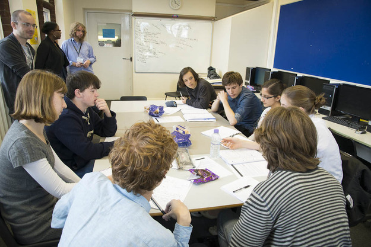

<header class="portfolio-header">
  <h1>For Students</h1>
</header>

<blockquote>
<q>I had never thought about making a book before until I had this opportunity - it's is a great chance of living a week as an author.</q>
<cite>One of our earliest writers</cite>
</blockquote>

So you want to write a book?  We've got good news and bad news.  The good news is that you can. We can come to your school, work with you in teams of ten, and by the end of a very intense week of writing you'll have published a novel. Along the way, you'll find out a lot about how narratives work, how to stay in command of your story and how to make your characters really work.

 The bad news is that we have to work directly with the school, we can't be retained by pupils themselves. So you need to point your school staff at this website. If they fill out the form on the [contact us](contact) page then, we'll send them a free book they can look at and then we can book in for some dates once we've sorted out invoices and copyright forms and so on. In the meantime, it's worth checking out our [FAQ](faq) or our existing [set of books](portfolio), which were all created by pupils like you.
 

