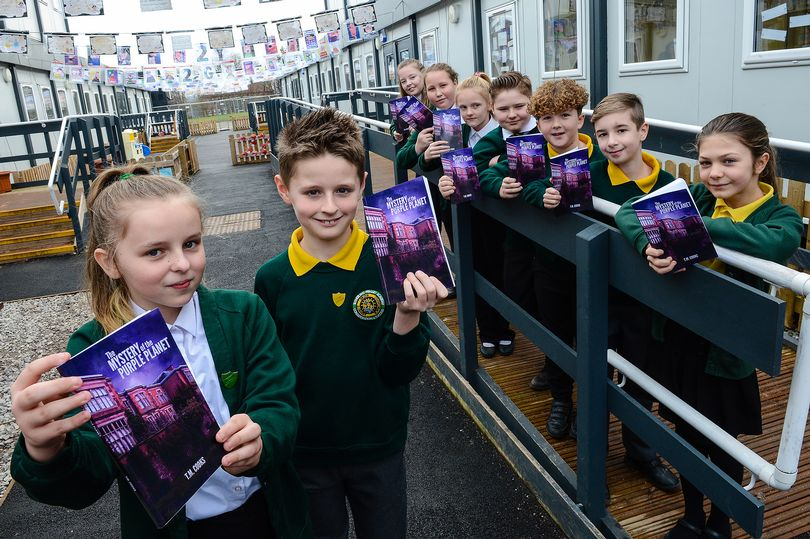
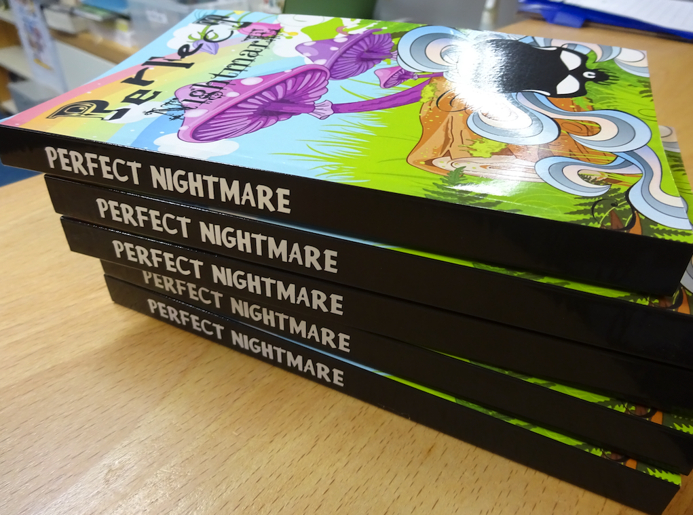

<header class="portfolio-header">
  <h1>For Teachers</h1>
</header>

<blockquote>
<q>
Being selected for the project has made the students realise that staff see, and value, their academic potential and strong personalities. Also, the students were unaware how much they could achieve when working independently, as their timetable is highly structured and supported. They surprised themselves-
</q>
<cite>A teacher in Stoke</cite>

</blockquote>

We are interested in young people who need something different.  They might be gifted and talented students who aren't being stretched, they might be writers who are having trouble with how education is structured. We've worked with writers across the UK, along with Nigeria, the Netherlands, and Japan.  

As a teacher, you know lots of students who might really benefit from this, but you have probably also seen lots of external groups over-promise and under-deliver.  That's our big problem as an organisation: nobody believes what we do is real until they see it. We have lots of wonderful repeat customers, and we adore going back to the same schools year after year, but we would like to reach more and more writers.

Here's what we do try and be as reassuring as possible: 

* We work a lot with researchers who collected a lot of data and write it up nicely.  We've got a whole page for [our research](research.html) and you can see how we've explored the overall long term effects on grades (students average about half a grade higher in their English GCSE)  
* We are transparent about our costs: you pay what it costs us to run.  For a single camp that works out at £1,400, which is mostly staff time. You can see a complete breakdown of costs [here](https://equalitytime.co.uk/6417/2020/03/02/analysis-of-white-water-writers-camp-costs/). 
* We send a free sample book to any teacher that asks for one. Having a glance through the finished article gives you a clear, visceral understanding of what we do and what your students can do. 

To get your free sample book, or enquire more generally, click the box below to let us know which school to send it to. 

<a class="box" href="{{site.baseurl}}/contact.html">Contact Us For Your Free Book!</a>  

<blockquote><q>
It was difficult selecting the students because of [NCOP]. So there were some where I thought oh God how they going to managed? Because maybe writing isn’t their strong point but actually to see it all come together, how they worked and how they became so dedicated to the book, didn’t they? They just wanted it to be a success and they really genuinely cared about how successful it was. So I think from that I was like ‘oh wow, I wish you cared this much about MacBeth’.
</q>
<cite>Member of staff at a multi-academy trust</cite>
</blockquote> 

